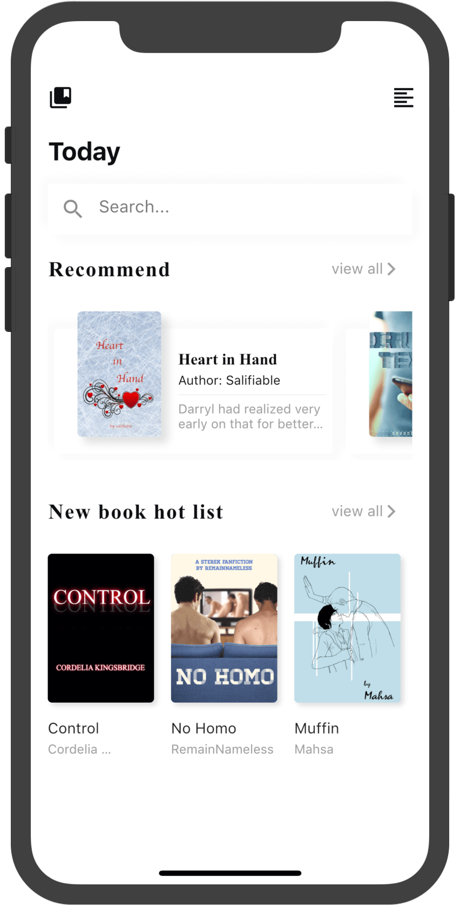
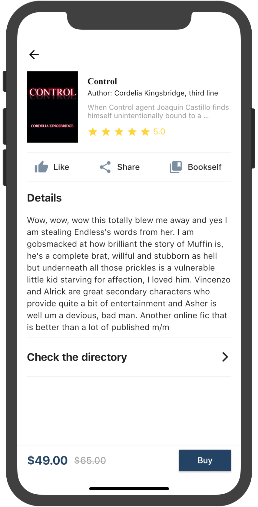
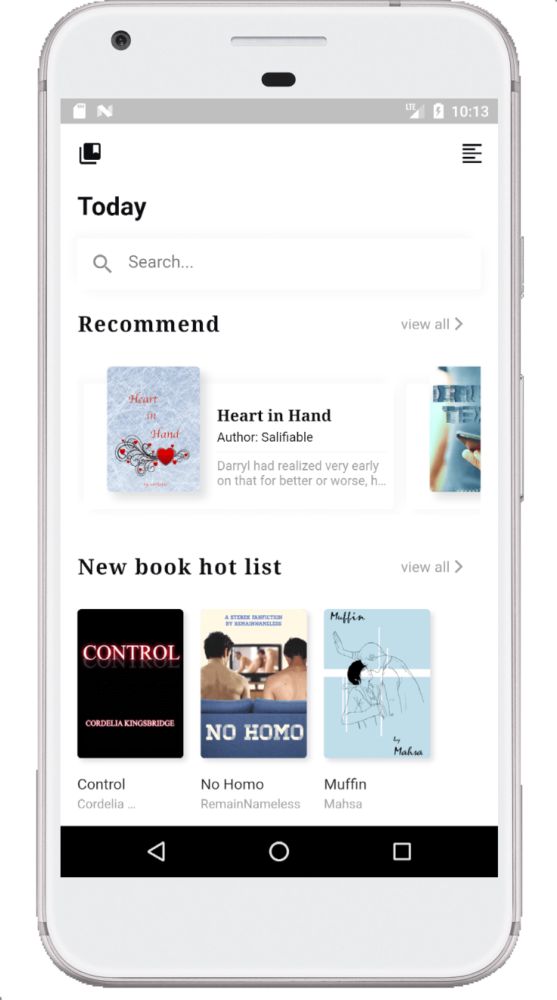
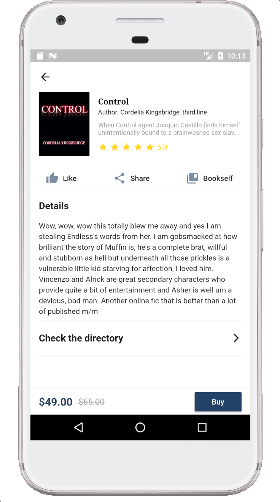

## 简介
界面来源自：[Dribble](https://dribbble.com/shots/5810845-Reading-App#)。感谢设计师精心设计的界面。
本项目的目的是加深对Flutter布局系统的理解
from https:&#x2F;&#x2F;dribbble.com&#x2F;shots&#x2F;5810845-Reading-App

## 效果

## iOS 

## Android

## 搜索功能展示

## Getting Started

This project is a starting point for a Flutter application.

A few resources to get you started if this is your first Flutter project:

- [Lab: Write your first Flutter app](https://flutter.io/docs/get-started/codelab)
- [Cookbook: Useful Flutter samples](https://flutter.io/docs/cookbook)

For help getting started with Flutter, view our 
[online documentation](https://flutter.io/docs), which offers tutorials, 
samples, guidance on mobile development, and a full API reference.

## 感谢

- Dribble原型设计 [Reading App by Xia](https://dribbble.com/shots/5810845-Reading-App#)
- 压缩图片网站 [TinyPNG](https://tinypng.com)
- 书籍数据来源网站 [GoodReads](https://www.goodreads.com)

## 参考

- [Flutter 文档](https://docs.flutter.io/)
- [ListView inside Column causes 'Vertical viewport was given unbounded height'](https://stackoverflow.com/questions/51681763/listview-inside-column-causes-vertical-viewport-was-given-unbounded-height)
- [how to create a row of scrollable text boxes or widgets in flutter inside a ListView?](https://stackoverflow.com/questions/46222788/how-to-create-a-row-of-scrollable-text-boxes-or-widgets-in-flutter-inside-a-list)
